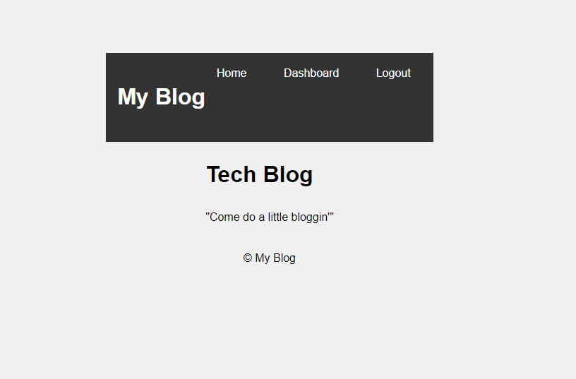
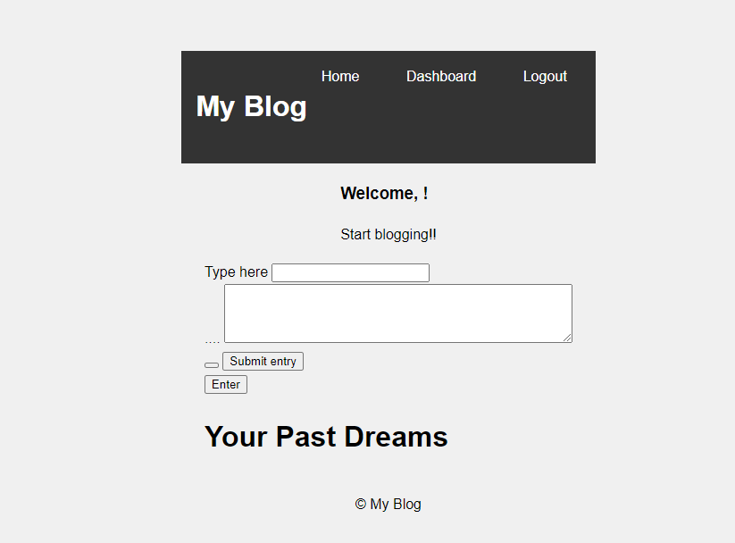

# blogdetech

Welcome to My Blog! This is a web application built with Node.js and Express, utilizing the Handlebars template engine to create a simple tech blog where users can view and share their tech-related thoughts and experiences.

## Features

- Write and submit new blog entries through the "Submit Journal" form.
- View past journal entries and their interpretations on the home page.
- Click on the "About" link in the navigation bar to learn more about the blog author.
- Click on the "Logout" link in the navigation bar to log out of the blog.

## Technologies Used

- Node.js
- Express.js
- Handlebars (Express Handlebars)
- Sequelize (for database interaction)
- Express-session (for session management)
- Bootstrap (for styling)
- Font Awesome (for icons)

## Getting Started

To run this application on your local machine, follow these steps:

1. Clone the repository: https://github.com/Simonhorrabin/blogdetech.git

2. Install the dependencies
 
3. Create a `.env` file in the root directory and set the required environment variables: Port, DB name, DB-user, DB-Password, DB-Host, Session-Secret

4. start the server with npm start

## Demo

